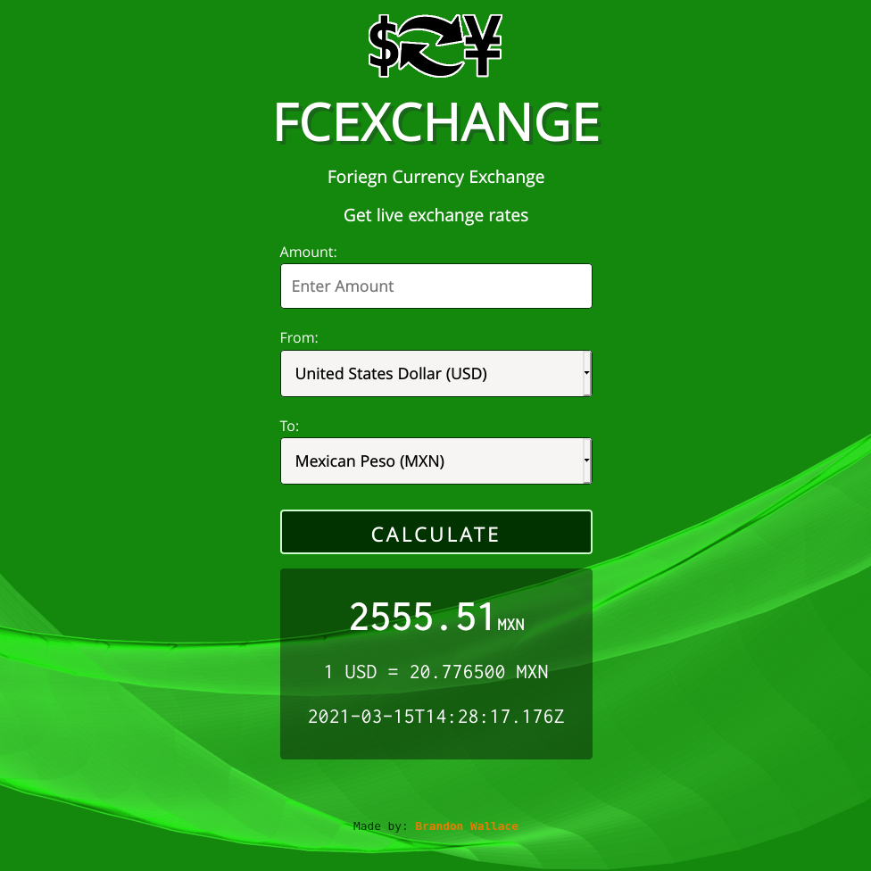

# Foreign Currency Exchange

# Built with Python 3, Flask, Javascript, HTML, and CSS.

# https://fcexchange.tk



```
├── application/
│   ├── static/
│   │   ├── css/
│   │   │   └── style.css
│   │   ├── images/
│   │   │   ├── background_dollars_pilled_up.png
│   │   │   ├── favicon.png
│   │   │   ├── logo.png
│   │   └── js/
│   │       └── script.js
│   ├── templates/
│   │   ├── 404.html
│   │   ├── 500.html
│   │   ├── base.html
│   │   └── index.html
│   ├── forms.py
│   ├── __init__.py
│   └── routes.py
├── Pipfile
├── Pipfile.lock
├── Procfile
├── requirements.txt
├── runtime.txt
├── readme.md
└── run.py
```

## $ pipenv shell

## $ pipenv install

## $ flask run

## http://127.0.0.1:5000
